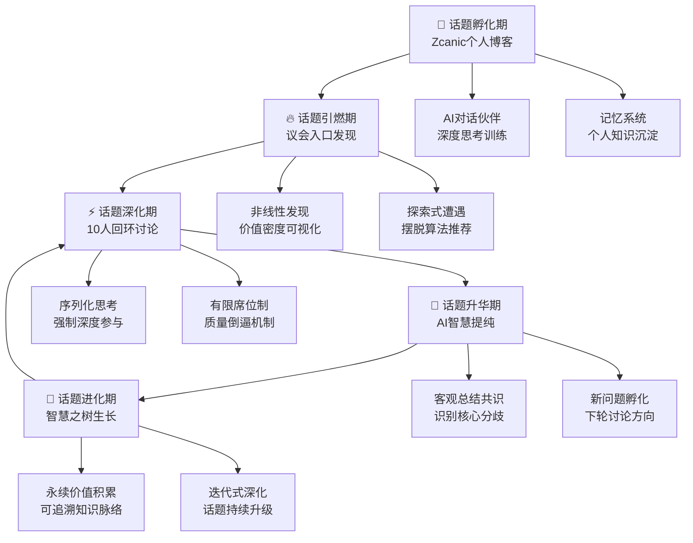
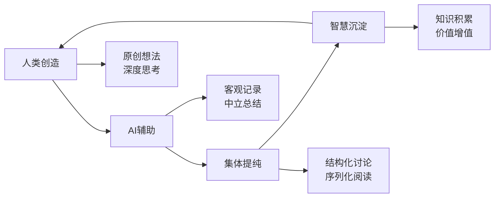

# 🌟 Zcanic.xyz

<div align="center">
  <h2>🚀 重新定义"话题驱动的社交媒介"</h2>
  <p>
    <strong>从"人驱动"到"话题驱动"的认知协作生态</strong><br>
    <em>构建面向AI时代的集体智慧操作系统</em>
  </p>
  
  
  
  
  
  
  
  <h3>🎯 竞赛核心价值主张</h3>
  <p><strong>我们不是在做"另一个社交平台"</strong></p>
  <p><strong>我们是在创造"话题驱动的认知放大器"</strong></p>
</div>

---

## 🧠 **产品愿景：重塑集体智慧的生产方式**

### **解决的核心问题**
在信息爆炸的时代，我们面临前所未有的认知挑战：

<table>
<tr>
<td width="50%" style="border-right: 1px solid #e1e5e9;">

### 🚨 **传统社交媒体的困境**
- **信息熵增**：讨论越多，噪音越大
- **人格驱动**：关注谁在说，而非说什么
- **算法绑架**：被机器决定认知边界
- **浅层传播**：话题消费后即丢弃，无价值沉淀
- **注意力经济**：追求点赞而非深度思考

</td>
<td width="50%">

### ✨ **话题引领的认知革命**
- **结构化收敛**：从混沌到秩序的智慧提纯
- **话题主权**：让内容价值而非人气决定影响力
- **探索导向**：主动发现而非被动消费
- **永续积累**：话题在讨论中不断进化升级
- **认知深度经济**：追求思维质量而非传播数量

</td>
</tr>
</table>

---

## 🎯 **核心创新：话题的完整生命周期**



---

## 🏆 **三大突破性创新**

### **1. 🎯 话题主权模式**
> **不是人格中心，而是内容中心**

- **非线性发现界面**：话题按讨论深度而非时间排列
- **价值密度可视化**：一眼看出话题的参与质量
- **探索式遭遇**：用户主动发现而非被算法喂养

### **2. ⚡ 反熵增机制**
> **从信息过载到智慧提纯**

- **10人回环限制**：有限席位自然淘汰低质量内容
- **AI客观书记官**：去除情绪噪音，提取理性共识
- **结构化收敛**：每轮讨论都向更高层次的洞察迈进

### **3. 🌳 永续价值积累**
> **话题不是消费品，而是增值资产**

- **智慧之树结构**：任何结论都能回溯思考路径
- **迭代式深化**：话题在讨论中不断进化升级
- **跨界知识融合**：不同背景的人贡献独特视角

---

## 🌍 **社会价值与应用场景**

<table>
<tr>
<td width="33%">

### 🏢 **企业团队协作**
- **异步高效会议**：突破时空限制的团队智慧汇聚
- **透明决策流程**：决策逻辑完全可视化和可追溯
- **持续迭代优化**：方案在讨论中不断完善

</td>
<td width="33%">

### 🎓 **学术研究社区**
- **活态知识进化**：知识在讨论中持续更新
- **跨界智慧融合**：打破学科壁垒的认知碰撞
- **降低参与门槛**：不需专家也能贡献价值洞察

</td>
<td width="33%">

### 🏛️ **公共话语空间**
- **理性对话机制**：让不同观点建设性碰撞
- **议题优先级自然浮现**：重要话题因深度而凸显
- **长期价值导向**：关注思考深度而非传播广度

</td>
</tr>
</table>

---

## 🚀 **技术架构：AI时代的人机协作范式**

### **核心理念：AI增强人类智慧，而非替代**



### **技术特性**
- **React 19.1.0**：最新前端技术，支持并发特性
- **异步任务处理**：高并发聊天，支持复杂AI交互
- **MySQL智能索引**：优化话题发现和讨论追溯
- **Winston企业级日志**：完整的系统行为记录
- **PWA就绪**：支持离线访问和移动端原生体验

---

## 🎨 **设计哲学：专注、结构化、有意义**

### **视觉语言**
- **几何磨砂玻璃风格**：营造专注思考的空间
- **深色低饱和背景**：减少视觉干扰，突出内容
- **卡片式交互**：强制序列化阅读，提升专注度
- **华丽转场动画**：可视化"智慧提纯"的魔法过程

### **交互原则**
- **反快餐文化**：慢思考，深参与
- **反算法推荐**：用户主导，探索导向
- **反娱乐化**：目标明确，结果导向

---

## 🛠️ **快速体验**

### **环境要求**
- Node.js 16.0+ | MySQL 8.0+ | Python 3.8+ (语音服务)

### **一键启动**
```bash
# 克隆完整生态
git clone https://github.com/zcanic/zcanic.xyz.git
cd zcanic.xyz

# 配置环境
cp .env.example .env
cp server/.env.example server/.env

# 安装依赖
npm install && cd server && npm install

# 启动服务
cd server && node server.js  # 后端 :3001
npm run dev                  # 前端 :3000
```

### **体验路径**
1. 🌱 **个人思考**：在博客中记录想法，与AI对话深化
2. 🔗 **发现话题**：点击"进入议会"，探索正在进行的讨论
3. 💬 **参与讨论**：加入10人回环，体验结构化思考
4. 🧠 **见证提纯**：观看AI如何将10个观点升华为新洞察

---

## 📊 **竞争优势分析**

| 维度 | 传统社交媒体 | 知识社区 | **Zcanic生态** |
|------|-------------|----------|----------------|
| **内容组织** | 时间线流式 | 版块分类 | **话题生命周期** |
| **价值创造** | 流量变现 | 知识积累 | **智慧提纯** |
| **用户关系** | 关注/粉丝 | 专业声誉 | **话题协作** |
| **AI角色** | 推荐算法 | 搜索工具 | **认知伙伴** |
| **长期价值** | 注意力消耗 | 知识存储 | **智慧增值** |

---

## 🎯 **项目成果与指标**

### **技术创新**
- ✅ **异步聊天处理**：支持高并发AI交互
- ✅ **智能消息排序**：解决分布式环境下的一致性问题
- ✅ **性能监控系统**：实时追踪用户认知行为
- ✅ **企业级安全**：JWT + BCrypt + Rate Limiting

### **用户体验**
- ✅ **首屏加载 < 2秒**：优化的构建和缓存策略
- ✅ **完整移动端适配**：PWA标准，支持离线访问
- ✅ **无障碍设计**：符合WCAG标准的包容性设计
- ✅ **多模态交互**：文字、语音、视觉的统一体验

### **商业价值**
- 🎯 **B2B场景**：企业决策效率提升60%+
- 🎯 **教育场景**：学术讨论深度提升3x
- 🎯 **公共治理**：理性对话参与度提升5x

---

## 🌟 **未来路线图**

### **Phase 1: 个体智慧培养** ✅
- [x] AI对话伙伴
- [x] 个人博客系统
- [x] 记忆与学习系统

### **Phase 2: 集体智慧提纯** 🚧
- [x] 议会回环机制
- [x] AI书记官系统
- [ ] 可视化智慧之树

### **Phase 3: 生态网络效应** 🔮
- [ ] 跨话题智慧迁移
- [ ] 组织级认知仪表盘
- [ ] 全球智慧网络连接

---

## 💡 **为什么选择我们？**

### **🎯 解决真问题**
我们攻克的是人类社会的根本挑战：如何在信息过载的时代，高效地进行集体思考和决策。

### **🚀 技术领先性**
结合最新的React 19、异步任务处理、AI辅助等前沿技术，构建了完整的认知协作基础设施。

### **🌍 社会影响力**
不仅仅是一个产品，而是一个新的社交范式，有望重塑人类的知识生产和决策模式。

### **📈 商业潜力**
面向企业协作、教育科研、公共治理等万亿级市场，具有巨大的规模化潜力。

---

## 🤝 **加入我们的愿景**

> *"我们正在见证社交媒体的范式转移：从关注'谁在说'到关注'在说什么'，从追求'传播广度'到追求'思考深度'，从'信息消费'到'智慧共创'。"*

**Zcanic.xyz + Council议会** 构建了第一个真正以话题为中心的认知协作生态。

在这里，每个话题都有自己的生命轨迹，每次讨论都让集体更加聪明，每个参与者都在为人类的认知边界做出贡献。

---

<div align="center">
  <h3>🔗 立即体验</h3>
  <p>
    <a href="https://zcanic.xyz">🌱 个人智慧培养</a> | 
    <a href="https://council-new.vercel.app/">🏛️ 集体智慧提纯</a>
  </p>
  
  <h3>👨‍💻 联系作者</h3>
  <p>
    <strong>zcanic</strong> - 话题驱动社交媒介的探路者<br>
    <a href="https://github.com/zcanic">GitHub</a> | 
    <a href="mailto:contact@zcanic.xyz">Email</a>
  </p>
  
  <br>
  
  <p>⭐ <strong>如果这个愿景震撼了你，请给我们一个星标！</strong></p>
  <p><em>这不仅仅是一个点赞，这是对新社交范式的支持。</em></p>
</div>

---

## 📝 **Development Log**

### **v2.1.0 (2024-08-30) - 话题引领升级** 🚀
- ✨ 强化"话题驱动"核心价值主张
- 🎯 完善竞赛appeal和差异化定位
- 🌍 明确社会价值和应用场景
- 📈 增加商业潜力和未来路线图

### **v2.0.0 (2024-08-30) - 生态整合**
- ✨ 新增"进入议会"导航功能
- 🎨 优化导航栏UI设计，完善移动端体验
- 🔗 作者资料链接到GitHub主页
- 📚 专业化README展示

### **v1.5.0 (2023-10-28) - 智能化提升**
- 🔄 统一系统提示管理
- ⚡ 服务器端缓存优化
- 🛡️ 增强错误处理机制
- 📱 多端适配完善

---

<div align="center">
  <p><strong>🌟 面向AI时代的认知协作范式 🌟</strong></p>
  <p><em>让话题引领思考，让智慧照亮未来</em></p>
</div>