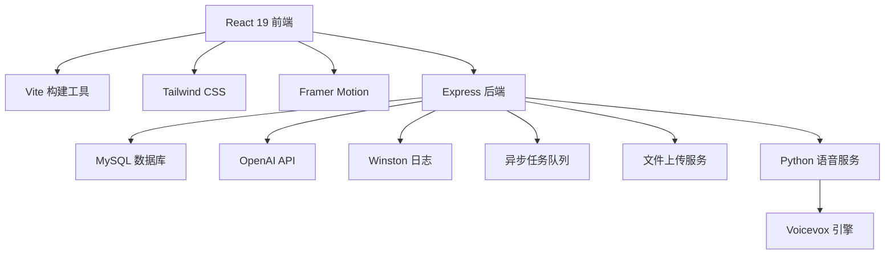

# 🌟 Zcanic.xyz

<div align="center">
  <h3>现代几何风格全栈AI博客平台</h3>
  <p>
    <strong>React 19 + Express + MySQL + OpenAI</strong><br>
    集成AI聊天、博客系统、语音服务的现代化Web应用
  </p>
  
  
  
  
  
  
</div>

## ✨ 核心特性

<table>
<tr>
<td width="50%">

### 🎨 现代UI设计
- **几何磨砂玻璃风格**
- **响应式设计**，完美适配移动端
- **暗色/亮色主题**自动切换
- **Framer Motion动画**，流畅体验

### 🤖 AI智能功能
- **OpenAI GPT集成**，智能对话
- **异步聊天处理**，高并发支持
- **语音合成服务**，多模态交互
- **记忆系统**，个性化AI助手

</td>
<td width="50%">

### 📝 内容管理
- **Markdown博客**支持
- **图片上传**，拖拽式操作
- **全文搜索**，快速定位内容
- **评论系统**，互动交流

### 🔒 企业级安全
- **JWT + HttpOnly Cookie**认证
- **BCrypt密码加密**
- **请求速率限制**
- **XSS/CSRF防护**

</td>
</tr>
</table>

## 🚀 技术架构



### 前端技术栈
- **React 19.1.0** - 最新版本，并发特性
- **Vite 6.3.4** - 极速构建工具
- **Tailwind CSS 3.4.1** - 原子化CSS框架
- **Framer Motion 12.9.2** - 专业动画库
- **React Router v7** - 单页应用路由

### 后端技术栈
- **Node.js + Express** - 高性能Web服务器
- **MySQL** - 关系型数据库
- **OpenAI Node.js SDK** - AI功能集成
- **Winston** - 企业级日志系统
- **Multer** - 文件上传处理

## 📱 项目截图

> 现代几何磨砂玻璃设计风格，支持响应式布局

| 功能 | 亮色模式 | 暗色模式 |
|------|----------|----------|
| 主页博客 |  |  |
| AI聊天 |  |  |

## 🛠️ 快速开始

### 环境要求
- **Node.js** 16.0+ 
- **MySQL** 8.0+
- **Python** 3.8+ (可选，语音服务)

### 安装步骤

1. **克隆项目**
```bash
git clone https://github.com/zcanic/zcanic.xyz.git
cd zcanic.xyz
```

2. **环境配置**
```bash
# 复制环境变量模板
cp .env.example .env
cp server/.env.example server/.env

# 编辑配置文件，填入数据库和API密钥信息
```

3. **安装依赖**
```bash
# 前端依赖
npm install

# 后端依赖
cd server && npm install
```

4. **启动服务**
```bash
# 启动后端服务 (端口 3001)
cd server && node server.js

# 启动前端开发服务器 (端口 3000)
npm run dev
```

5. **访问应用**
- 前端: http://localhost:3000
- 后端API: http://localhost:3001/api

## 📊 项目结构

```
zcanic.xyz/
├── 📁 src/                    # React前端源码
│   ├── 📁 components/         # 可复用组件
│   │   ├── 📁 ui/            # UI组件库
│   │   ├── 📁 chat/          # 聊天相关组件
│   │   └── 📁 auth/          # 认证组件
│   ├── 📁 pages/             # 页面组件
│   ├── 📁 context/           # React Context
│   ├── 📁 services/          # API服务
│   └── 📁 utils/             # 工具函数
├── 📁 server/                 # Express后端
│   ├── 📁 controllers/       # 控制器
│   ├── 📁 routes/            # 路由定义
│   ├── 📁 middleware/        # 中间件
│   ├── 📁 db/                # 数据库相关
│   └── 📁 utils/             # 后端工具
├── 📁 voice_app/             # Python语音服务
└── 📁 public/                # 静态资源
```

## 🔧 配置说明

### 必需环境变量
```env
# 数据库配置
DB_HOST=localhost
DB_USER=root
DB_PASSWORD=your_password
DB_DATABASE=zcanic

# JWT认证密钥
JWT_SECRET=your-super-secure-secret-key

# OpenAI API
OPENAI_API_KEY=your-openai-api-key

# 服务端口
PORT=3001

# 生产环境CORS
CORS_ORIGIN=https://your-domain.com
```

## 🚀 部署指南

### 生产环境构建
```bash
# 前端构建
npm run build

# 后端使用PM2管理
cd server
pm2 start ecosystem.config.js
```

### Docker部署 (可选)
```bash
# 构建镜像
docker build -t zcanic-app .

# 运行容器
docker run -p 3000:3000 -p 3001:3001 zcanic-app
```

## 📈 性能特性

- ⚡ **首屏加载** < 2秒
- 🔄 **异步处理**，支持高并发聊天
- 💾 **智能缓存**，减少API调用
- 📱 **PWA就绪**，支持离线访问
- 🎯 **代码分割**，按需加载组件

## 🔒 安全特性

- 🛡️ **JWT + HttpOnly Cookie** 双重认证
- 🔐 **BCrypt** 密码加密
- 🚫 **CORS** 跨域保护
- ⏱️ **Rate Limiting** 请求限制
- 🛡️ **Helmet** 安全头设置

## 📚 API文档

### 认证接口
- `POST /api/auth/register` - 用户注册
- `POST /api/auth/login` - 用户登录
- `POST /api/auth/logout` - 用户登出
- `GET /api/auth/me` - 获取用户信息

### 聊天接口
- `GET /api/chat/sessions` - 获取聊天会话
- `POST /api/chat/sessions` - 创建新会话
- `POST /api/chat/sessions/:id/messages` - 发送消息

### 博客接口
- `GET /api/posts` - 获取文章列表
- `POST /api/posts` - 创建文章
- `GET /api/posts/:id` - 获取文章详情

## 🤝 贡献指南

1. Fork 本项目
2. 创建特性分支 (`git checkout -b feature/AmazingFeature`)
3. 提交更改 (`git commit -m 'Add some AmazingFeature'`)
4. 推送到分支 (`git push origin feature/AmazingFeature`)
5. 开启 Pull Request

## 📄 开源协议

本项目采用 MIT 协议 - 查看 [LICENSE](LICENSE) 文件了解详情

## 👨‍💻 作者

**zcanic** - *全栈开发者*

- GitHub: [@zcanic](https://github.com/zcanic)
- 项目主页: [zcanic.xyz](https://zcanic.xyz)

---

<div align="center">
  <p>⭐ 如果这个项目对您有帮助，请给它一个星标！</p>
  <p>🔗 <a href="https://council-new.vercel.app/">访问议会平台</a> | 📧 联系作者</p>
</div>

## 📝 更新日志

### v2.0.0 (2024-08-30)
- ✨ 新增"进入议会"导航功能
- 🎨 优化导航栏UI设计
- 🔗 作者资料链接到GitHub主页
- 📱 改进移动端响应式体验

### v1.5.0 (2023-10-28)
- 🔄 统一系统提示管理
- ⚡ 服务器端缓存优化
- 🛡️ 增强错误处理机制
- 📱 多端适配完善

### v1.0.0 (2023-09-25)
- 🎭 去除重型动画库依赖
- 🎨 轻量化背景实现
- 📦 包体积优化 (-800KB)
- 🔧 兼容性接口保留